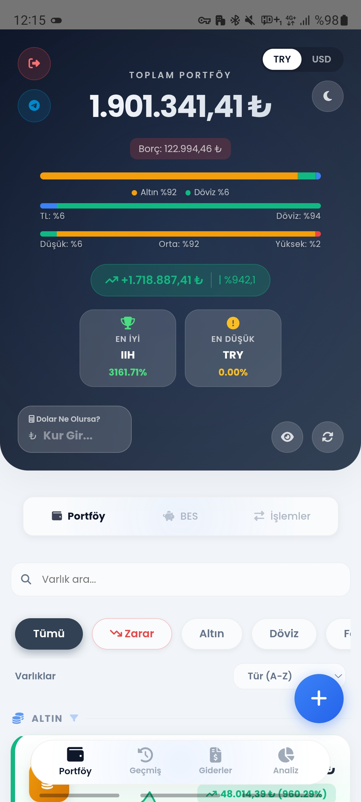

# Altindas Finans 📊💰

> **Varlık, BES ve gider takibi tek ekranda! Banka şifresi girmeden bütçenizi yönetin.**

Altindas Finans; varlıklarınızı, Bireysel Emeklilik (BES) birikimlerinizi ve aylık harcamalarınızı tek bir çatı altında, tamamen gizlilik odaklı olarak takip etmenize yardımcı olmak üzere tasarlanmış kapsamlı bir kişisel finansal yönetim asistanıdır.

Banka şifrelerinizi veya hassas hesap bilgilerinizi hiç kimseyle paylaşmak zorunda kalmadan, bütçenizin ve yatırımlarınızın kontrolünü tamamen kendi elinize alın. Akıllı bulut senkronizasyonu ile verilerinize her an ulaşın, finansal özgürlüğünüze giden yolu bugünden planlayın!

---

## 🚀 Demo Hesabı ile Deneyin!

Uygulamanın arayüzünü ve özelliklerini hemen keşfetmek için aşağıdaki demo hesap bilgilerini kullanabilirsiniz:

* **E-mail:** `demo@altindasfinans.com`
* **Şifre:** `demodemo`

> ⚠️ **Not:** Demo hesaptaki portföy, geçmiş işlemler ve gider verileri tamamen temsilidir. Yalnızca okuma izni aktiftir; veri ekleme/silme işlemleri kapalıdır.

---

## 📸 Ekran Görüntüleri ve Detaylı Kullanım

Altindas Finans'ın sunduğu modülleri ve kullanıcı arayüzünü aşağıda detaylıca inceleyebilirsiniz:

### Ana Portföy Ekranı
Uygulamanın genel özetini sunan, toplam varlıklarınızı, güncel kâr/zarar durumunuzu ve finansal özetinizi tek bakışta görebileceğiniz merkezi kontrol panelidir.

### Portföy Sayfası - Varlıklar Ekranı
Sahip olduğunuz altın, gümüş, hisse senedi, yatırım fonu ve döviz gibi tüm varlık kalemlerinin liste halinde detaylandırıldığı ve anlık değerlerinin takip edildiği ekrandır.

### Portföy Sayfası - Varlık İşlem Geçmişi Ekranı
Sahip olduğunuz altın, gümüş, hisse senedi, yatırım fonu ve döviz gibi tüm varlık kalemlerinin geçmiş hareketlerinin görüntülenebildiği ve düzenlenebildiği ekrandır.

### Portföy Sayfası - Varlık Ekleme Ekranı
Sahip olduğunuz altın, gümüş, hisse senedi, yatırım fonu ve döviz gibi tüm varlık kalemlerinin portföye eklenebildiği ekrandır.

### Bireysel Emeklilik (BES) Ekranı
Aile bireylerinin BES hesaplarını, kurum ve kişi bazlı ayırarak güncel birikim tutarlarını, katkı paylarını ve getiri durumlarını izleyebileceğiniz özel sayfadır.

### Bireysel Emeklilik (BES) Ekranı
Aile bireylerinin BES hesaplarının portföye otomatik işlenebilmesi için "Aylık BES Planlaması" ekranıdır. Belirlenen tarihlerde sistem otomatik olarak BES hesabına TRY Alım olarak işlem yapmaktadır.

### İşlemler Sayfası - Canlı Fiyat Sorgulama
Yatırım araçlarının anlık piyasa fiyatlarını arama çubuğu üzerinden hızlıca sorgulayıp, güncel verilerle doğru işlem kararları almanızı sağlayan modüldür.

### İşlemler Sayfası - İşlem Kayıtları
Geçmişte yaptığınız tüm alım ve satım işlemlerini, ilgili tarihteki maliyetlerinizi ve adet bazlı geçmiş verilerinizi kronolojik olarak listeleyen detay ekranıdır.

### İşlemler Sayfası - Geçmmiş Kur ile Hesaplama
Geçmişte yaptığınız tüm alım ve satım işlemlerini, ilgili tarihteki maliyetlerinizi ve ilgili tarihin USD kuru alınarak kar/zarar hesabınızı görüntülemenize yarar.

### Geçmiş Sayfası - Hedef ve Ana Ekran
Finansal özgürlük hedeflerinize ne kadar yaklaştığınızı, net tasarruf ivmenizi ve hedefinize kalan tahmini süreyi gösteren motivasyon odaklı sayfadır.

### Portföy Kıyaslama ve Performans Grafikleri
Portföyünüzün enflasyon, BIST 100, altın gibi temel göstergelere karşı performansını, varlıklarınızın dönemsel gelişimini ve trendini analiz eden detaylı grafik alanıdır.

### Portföy Kıyaslama ve Performans Grafikleri
Portföyünüzde yer alan varlıkların toplam tutarlarının zaman içerisindeki değişimleri (Portföy Gelişimi) ve birim fiyatlarının zaman içerisindeki değişimlerini (Varlık Performansı) görebileceğiniz detaylı grafik alanıdır.

### Geçmiş Veri Yönetimi Düzenleme Ekranı
Portföyünüzde yer alan varlıkların toplam tutarları ve birim fiyatları günlük kayıt altına alınmaktadır. Geçmişe yönelik birim fiyat ve toplam tutarları değiştirebileceğiniz ekrandır.

### Geçmiş Sayfası - Enflasyon Butonu
Portföyünüzde yer alan varlıkları kıyaslamak amacıyla her ay açıklanan yıllık TÜİK Enflasyon verisini gireceğiniz ekrandır. Yıllık gireceğiniz enflasyon verisi aylık kümülatif olarak hesaplanmaktadır.

### Geçmiş Veri Yönetimi Düzenle Butonu
Geçmiş dönemlerde girdiğiniz finansal kayıtları veya harcamaları esnek bir şekilde güncelleyip, olası hataları düzeltebileceğiniz pratik yönetim aracıdır.

### Giderler Sayfası Headerı
Aylık toplam giderlerinizi, kullanıma kalan bütçenizi ve yaklaşan ödemelerinizi en üstte hap bilgi olarak özetleyen kullanıcı dostu başlıktır.

### Giderler Sayfası Son 5 Gün Bildirim Ekranı
Son 5 gün içerisinde yaklaşan İşlem veya Ödemelerinizi görebileceğiniz ekranın en üst tarafında yer alan kutucuktur.

### Giderler Sayfası Detaylı Kart Raporu
Ödeme kartınıza tıkladığınız zaman o karta ait harcamalarınızı görüntüleyebileceğiniz ve düzenleyebileceğiniz ekrandır.

### Giderler Sayfası Bütçe Planlama Ekranı
Planlama butonuna tıkladığı zaman aylık harcama bütçenizi, harcama kategorilerinizi ve kart ödeme kurallarını belirleyebildiğiniz ekrandır.

### Giderler Sayfası Gider Ekleme Ekranı
Gider ekleme butonuna tıkladığınız zaman, daha önce belirlediğiniz kart ödeme kuralları çerçevesinde, ödeme tarihini ve kart adını otomatik olarak belirler. Eğer harcamanız Nakit ise doğrudan ödendi olarak varsayılarak portföyünüzdeki TRY Varlığından düşmektedir.
Aksiyon takibi yapılsın mı? kutucuğu ise işlemleriniz içindir. Eğer işaretlersiniz belirlediğiniz harcama tarihine geldiği zaman "Son 5 Gün Bildirim Ekranında" bekleyen işlem olarak görüntülenmektedir. (Örneğin MTV Ödemesi son ödeme tarihi 31 Temmuz, Ödediğiniz kartın son ödeme tarihi ise 25 Ağustos. 26 Temmuz tarihine gelindiği andan itibaren MTV ödemesini size hatırlatmak için ekranda belirecektir.

### Abonelikleri Aktar Butonu
Her ay tekrarlayan fatura, aidat ve dijital abonelik gibi sabit giderlerinizi tek bir tuşla kopyalayarak otomatik olarak sonraki aya aktaran zaman kazandırıcı özelliktir.

### Bütçe Planlama ve Kart Ayarları
Dinamik kredi kartı taksitlendirmelerini, hesap kesim tarihlerini ve aylık hedef bütçe sınırlarınızı kişiselleştirebileceğiniz ayar ekranıdır.

### Analiz Sayfası İlk Giriş
Harcama alışkanlıklarınızı ve genel bütçe durumunuzu detaylandırmak için tasarlanmış geniş kapsamlı analiz modülünün ana görünümüdür. Ayrıca aracınıza ait masrafları ve km bilgilerini gider eklerken girerseniz ortalama maliyeti, TL/KM ve LT/100km tüketimlerini görüntüleyebilirsiniz.

### Ödeme, Harcama Analizi ve Trend Grafikleri
Ödemelerinizin ve harcamalarınızın aylık trendini, yaklaşan ödeme takviminizi ve bütçenizin zaman içindeki değişimini görselleştiren dinamik grafik ekranıdır.

### Analiz Sayfası - Geçmiş Gider Yönetimi
Analiz raporlarını incelerken fark ettiğiniz geçmiş dönem gider kayıtlarına doğrudan müdahale edip hızlıca düzenlemenizi sağlayan kısayol alanıdır.

### Analiz Sayfası - Pasta Grafikleri
İlgili aydaki harcamalarınızı kategorilerine (market, ulaşım, fatura vb.) göre ayırarak, bütçenizin hangi alanlara dağıldığını oransal olarak net bir şekilde gösteren görsel analizdir.

### Telegram Bağlantı Kutucuğu
Kişisel Telegram botunuzu sisteme entegre ederek günlük/haftalık otomatik bildirimler almanızı ve doğal dilde mesajlarla hızlı veri girişi yapmanızı sağlayan bağlantı alanıdır.

* ### Telegram Günlük Finans Özeti Tablosu
Kişisel Telegram botunuzdan size özel her gün akşam günü özetleyen bir tablo gönderir.

* ### Telegram Varlık Performans Karnesi
Kişisel Telegram botunuz size her sabah varlılarınızın günlük, haftlaık, aylık birim fiyat değişimlerini tablo haline getirip atar.

* ### Telegram Günlük Finans Raporu
Kişisel Telegram botunuz size her sabah güncel portföy değerinizi, net karınızı, toplam borcunuzu gönderir. Portföy değişimlerini ve Kar değişimlerini günlük, haftalık, aylık değişimler halinde sizlere sunar.

* ### Telegram Haftalık Finans Raporu
Kişisel Telegram botunuz size her haftanın son günü akşam saatlerinde haftayı özetleyen bir rapor sunar. Haftalık harcama özetini ve belirlediğiniz kategorilerin ne kadarının kullanıldığını sizlere sunar.

* ### Telegram Aylık Finans Raporu
Kişisel Telegram botunuz size her ayın 1. günü geçmiş aya dair Varlık durumunuzu, Kar/zarar durumunu ve toplam harcamanızı içeren bir tablo sunar. 

* ### Telegram Genel Bütçe Alarmı
Kişisel Telegram botunuz size bütçenizin %80'ini aştığınız andan itibaren her gün aynı saatte güncel bütçe durumunuzu gösteren bir tablo gönderir.

* ### Telegram Piyasa Sert Hareketler Alarmı
Kişisel Telegram botunuz size portföyünüzdeki bir varlığın bir gün içerisinde %2'yi aşan bir değişim olduğu zaman anında haber verir.

* ### Telegram Ödeme Hatırlatıcısı
Kişisel Telegram botunuz size ödemenin olduğu gün ve bir gün öncesinde uyarı mesajı gönderir.

* ### Telegram Ödeme İçin Nakit Hatırlatıcısı
Kişisel Telegram botunuz size önümüzdeki 14 günün ödemesi kadar TRY varlığınız yok ise bir uyarı mesajı gönderir.

* ### Telegram Harcama Gideri
Kişisel Telegram botunuza hızlıca giderlerinizi ekleyebilirsiniz. Sisteme belirlediğiniz kart kuralları dahilinde ödeme kartını ve ödeme tarihini otomatik çeker ve sisteme işler.

* ### Telegram Harcama Gideri - Nakit
Kişisel Telegram botunuza hızlıca nakit harcamnızı ekleyebilirsiniz. Sistem nakit harcamalarınızı doğrudan portföyünüzdeki TRY varlığından "ödendi" olarak düşer.

---

## 🌟 Öne Çıkan Özellikler

### 📊 1. Gelişmiş Portföy ve Varlık Takibi
* **Çoklu Varlık Desteği:** Altın, Gümüş, Yatırım Fonu (TEFAS), Hisse Senedi (BIST), Eurobond, Döviz ve Nakit birikimlerinizi tek bir havuzdan yönetin.
* **Canlı Piyasa Fiyatları:** Yatırım araçlarınızın güncel fiyatlarını ve anlık kâr/zarar durumunuzu özel grafiklerle izleyin. (Emtia fiyatlarının piyasa satış fiyatlarını göstermektedir.)
* **Detaylı İşlem Geçmişi:** Alım ve satım işlemlerinizi, maliyetinizi ve güncel birim fiyatlarını tek bir ekranda karşılaştırın. Hızlı sorgulama ekranıyla piyasa fiyatlarına anında ulaşın.
* **Reel Getiri (USD) Analizi:** TL bazında kâr ettiğiniz işlemlerin, geçmiş tarihli kur üzerinden USD bazlı gerçek getiri veya zararını şeffafça görün.
* **Kapsamlı Kıyaslama (Benchmark):** Portföyünüzün büyümesini; Enflasyon, BIST 100, Ons/Gram Altın ve Gümüş karşısında canlı olarak test edin.
* **Dönemsel Performans:** Varlıklarınızın günlük, haftalık, aylık ve yıllık değişim trendlerini tek bir grafik üzerinden kolayca analiz edin.
* **Çift Para Birimi & Gizlilik Modu:** Portföyünüzü tek dokunuşla TRY veya USD olarak görüntüleyin. Ortak alanlarda tek tuşla bakiyenizi gizleyin.

### 🛡️ 2. Bireysel Emeklilik (BES) Planlaması
* Aile bireylerinin BES birikimlerini kurumlara ve kişilere göre ayrı ayrı takip edin.
* Aylık otomatik yatırım, katkı payı ve tasarruf hedefleri belirleyerek geleceğinizi güvence altına alın.

### 💳 3. Akıllı Bütçe ve Gider Takibi
* **Dinamik Kredi Kartı Öngörüsü:** Harcama tarihinize göre; ödemenin hangi kredi kartıyla, ne zaman ve hangi taksitlendirme koşullarıyla yapılacağını otomatik hesaplatın.
* **Yaklaşan Ödemeler Merkezi:** Son ödeme tarihi veya işlem zamanı yaklaşan harcamalarınızı ana ekranda görerek gecikme faizlerinin önüne geçin.
* **Abonelik Kopyalama:** Her ay tekrarlayan sabit giderlerinizi tek tuşla sonraki aya aktarın.
* **Detaylı Bütçe Analizi:** Harcama trendi grafikleri ve pasta grafikleriyle bütçenizin kontrolünü elinizde tutun.

### 🚘 4. Araç Maliyet ve Yakıt Analizi
* Akaryakıt, bakım, kasko, sigorta ve MTV giderlerinizi tek bir yerde toplayın.
* Tüketim verilerini girerek aracınızın yakıt verimliliğini (TL/km ve Litre/100km) analiz edin.

### 🎯 5. Finansal Özgürlük ve Hedef Takibi
* **Finansal Yaşam Süresi Hesaplayıcı:** Mevcut varlıklarınızın, sizi çalışmadan ne kadar süre finanse edebileceğini keşfedin.
* **Gelecek Tahminleme:** Belirlediğiniz finansal hedeflere ne kadar yaklaştığınızı izleyin.
* **Tasarruf Grafikleri:** 3 Aylık, 6 Aylık ve Yıllık bazda dönemsel tasarruf oranlarınızı takip edin.

### 🤖 6. Kişisel Telegram Bot Entegrasyonu (Premium & İsteğe Bağlı)
* **Portföy Takip Mesajları:** Portföy performans değişimlerini, harcama özetlerini ve yaklaşan ödeme bildirimlerini otomatik alın. Kalan harcama limitiniz azaldığında uyarı mesajı alın.
* **Harcama Takip Mesajları:** Haftalık ve aylık portföy ve harcama özetlerini alın..
* **Ödeme Takip Mesajları:** İki hafta içerisindeki ödeme tutarlarınız Nakit(TRY) varlıklarınızdan yüksek olduğu durumlarda “Nakit İhtiyacı” uyarısı alın.
* **Kategori Takip Mesajları:** Harcama kategorilerine ait bildirimler alın. Kategorinin %80’ine ulaştınız andan itibaren hem bildirim alın hem de günlük kalan harcama limitinizi öğrenin.
* **Hızlı Veri Girişi:** Telegram üzerinden *"25 Market"* veya *"1200 Alışveriş 3taksit"* gibi mesajlar atarak harcamalarınızı sisteme saniyeler içinde kaydedin.

---

## 🔒 Gizlilik ve Güvenlik Odaklı Mimari

* **Banka Entegrasyonu Yoktur:** Uygulama, banka veya aracı kurum hesaplarınıza asla bağlanmaz. Finansal şifrelerinizi kesinlikle talep etmez.
* **Verileriniz Sizin Kontrolünüzde:** Bilgileriniz Firebase altyapısında size özel olarak şifrelenir. Dilediğiniz zaman tüm geçmişinizi ve hesabınızı tek tuşla kalıcı olarak silebilirsiniz.

---

## ⚠️ Yasal Uyarı (Disclaimer)

Altindas Finans uygulaması; 6362 sayılı Sermaye Piyasası Kanunu kapsamında portföy yöneticiliği, yatırım danışmanlığı veya sinyal üretimi hizmeti sunmaz. Uygulamada yer alan hesaplamalar, grafiksel kıyaslamalar ve bütçe simülasyonları tamamen kişisel takip ve bilgi amaçlı olup kesinlikle **Yatırım Tavsiyesi Değildir (YTD)**.

---

## 👨‍💻 Geliştirici

* **GitHub:** [@altindas](https://github.com/altindas)
* **Proje Bağlantısı:** [Altindas Finans Repo](https://github.com/altindas/altindas-finans)
* **Email:** mehmetaltindas@pm.me
